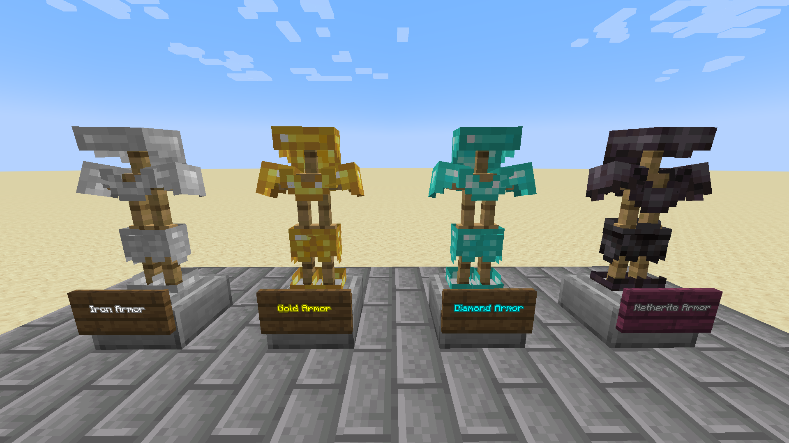
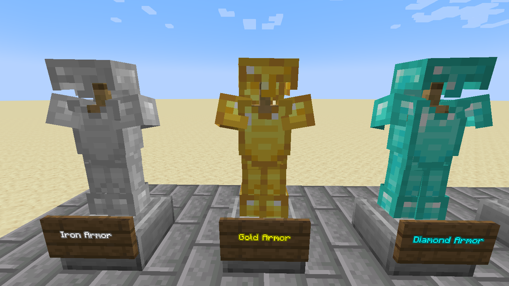
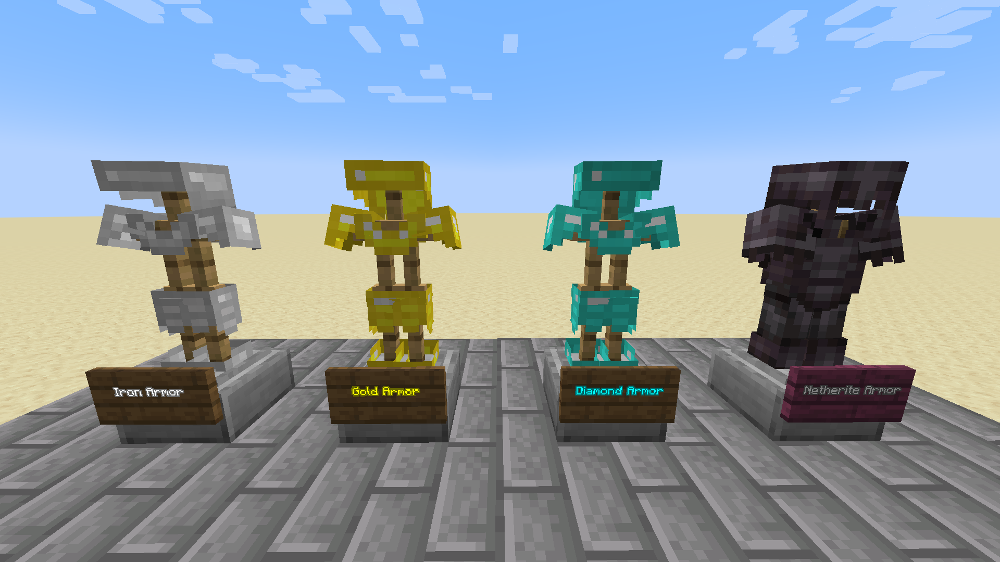

# Solarflame's light armor
A resource pack made by me inspired by [Dresdom](https://www.reddit.com/user/Dresdom/)'s [light armor pack](https://www.reddit.com/r/Minecraft/comments/7e8zqv/i_made_a_light_armor_resource_pack/), using the original Minecraft textures as a base

the pack might appear "incompatible" but it's compatible with all versions past 1.8
# Screenshots
My pack:

Default textures:

Dresdom's pack:

